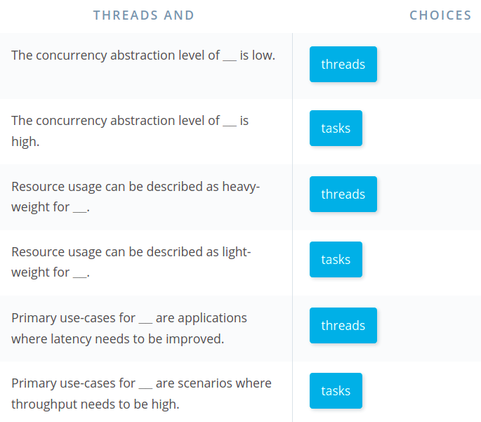

# Passing Data Between Threads

## C3.2 : Promises and Futures

The methods for passing data to a thread we have discussed so far are both useful during thread construction: We can either pass arguments to the thread function using variadic templates or we can use a Lambda to capture arguments by value or by reference. The following example illustrates the use of these methods again:

```c++
#include <iostream>
#include <thread>

void printMessage(std::string message)
{
    std::this_thread::sleep_for(std::chrono::milliseconds(10)); // simulate work
    std::cout << "Thread 1: " << message << std::endl;
}

int main()
{
    // define message
    std::string message = "My Message";

    // start thread using variadic templates
    std::thread t1(printMessage, message);

    // start thread using a Lambda
    std::thread t2([message] {
        std::this_thread::sleep_for(std::chrono::milliseconds(10)); // simulate work
        std::cout << "Thread 2: " << message << std::endl;
    });

    // thread barrier
    t1.join();
    t2.join();

    return 0;
}
```

A drawback of these two approaches is that the information flows from the parent thread (`main`) to the worker threads (`t1` and `t2`). In this section, we want to look at a way to pass data in the opposite direction - that is from the worker threads back to the parent thread.

There is a such a mechanism available in the C++ standard that we can use for this purpose. This mechanism acts as a single-use channel between the threads. **The sending end of the channel is called "promise" while the receiving end is called "future".**

In the C++ standard, the class template std::promise provides a convenient way to store a value or an exception that will acquired asynchronously at a later time via a `std::future` object. Each `std::promise` object is meant **to be used only a single time.**


```c++
#include <iostream>
#include <thread>
#include <future>

void modifyMessage(std::promise<std::string> && prms, std::string message)
{
    std::this_thread::sleep_for(std::chrono::milliseconds(4000)); // simulate work
    std::string modifiedMessage = message + " has been modified"; 
    prms.set_value(modifiedMessage);
}

int main()
{
    // define message
    std::string messageToThread = "My Message";

    // create promise and future
    std::promise<std::string> prms;
    std::future<std::string> ftr = prms.get_future();

    // start thread and pass promise as argument
    std::thread t(modifyMessage, std::move(prms), messageToThread);

    // print original message to console
    std::cout << "Original message from main(): " << messageToThread << std::endl;

    // retrieve modified message via future and print to console
    std::string messageFromThread = ftr.get();
    std::cout << "Modified message from thread(): " << messageFromThread << std::endl;

    // thread barrier
    t.join();

    return 0;
}
```

Steps including:

- Create promise
- Create future using `promise.get_future()`
- Pass promise into a thread using `std::move`
- Retrieve data using `future.get()`, and wait for response
- Send data using `promise.set_value()`

It is also possible that the worker value calls set_value on the promise before `get()` is called on the future. In this case, `get()` returns immediately without any delay. After `get()` has been called once, the future is no longer usable. This makes sense as the normal mode of data exchange between promise and future works with `std::move` - and in this case, the data is no longer available in the channel after the first call to `get()`. If `get()` is called a second time, an exception is thrown.

**Additional blocking method before get data**

- `wait_for()`: block either until the specified timeout duration has elapsed or the result becomes available - whichever comes first. The return value identifies the state of the result.

```c++
auto status = ftr.wait_for(std::chrono::milliseconds(1000));
    if (status == std::future_status::ready) // result is ready
    {
        std::cout << "Result = " << ftr.get() << std::endl;
    }

    //  timeout has expired or function has not yet been started
    else if (status == std::future_status::timeout || status == std::future_status::deferred)
    {
        std::cout << "Result unavailable" << std::endl;
    }
```

### Passing exceptions

Use `promise.set_exception()` instead of `promise.set_value()`

```c++
void divideByNumber(std::promise<double> &&prms, double num, double denom)
{
    std::this_thread::sleep_for(std::chrono::milliseconds(500)); // simulate work
    try
    {
        if (denom == 0)
            throw std::runtime_error("Exception from thread: Division by zero!");
        else
            prms.set_value(num / denom);
    }
    catch (...)
    {
        prms.set_exception(std::current_exception());
    }
}

/// ... In main thread, retrieve result within try-catch-block
try
{
    double result = ftr.get();
    std::cout << "Result = " << result << std::endl;
}
catch (std::runtime_error e)
{
    std::cout << e.what() << std::endl;
}
```

**3 Drawbacks of promises and futures**

- One way communication only, from worker to parent
- Single time usage only
- Boilerplate code for minor functionality 


## Threads vs Tasks

### Starting threads with async

There is a simpler and more convenient way using `std::async()` instead of `std::thread()` for data passing usage.

```c++
double divideByNumber(double num, double denom)
{
    std::this_thread::sleep_for(std::chrono::milliseconds(500)); // simulate work

    if (denom == 0)
        throw std::runtime_error("Exception from thread: Division by zero!");

    return num / denom;
}


int main()
{
    // use async to start a task
    double num = 42.0, denom = 2.0;
    std::future<double> ftr = std::async(divideByNumber, num, denom);

    // retrieve result within try-catch-block
    try
    {
        double result = ftr.get();
        std::cout << "Result = " << result << std::endl;
    }
    catch (std::runtime_error e)
    {
        std::cout << e.what() << std::endl;
    }

    return 0;
}
```

**Enforce "synchronous" or "asynchronous"** 

`std::future<double> ftr = std::async(std::launch::deferred, divideByNumber, num, denom);`

If we were to use the launch option **"async"** instead of **"deferred"**, we would enforce an asynchronous execution whereas the option **"any"** would leave it to the system to decide - which is the default. 

By leaving the decision to the system, we can ensure that the number of threads is chosen in a carefully balanced way that optimizes runtime performance by looking at the current workload of the system and the multi-core architecture of the system.

### Thread vs Tasks Quiz




**Always use `std::async` because of its simpler design, but please use `std::thread` when input output are not needed.**


## Avoiding Data Races


In this example, one safe way of passing data to a thread would be to carefully synchronize the two threads using either `join()` or the promise-future concept that can guarantee the availability of a result. Data races are always to be avoided. Even if nothing bad seems to happen, they are a bug and should always be treated as such. Another possible solution for the above example would be to make a copy of the original argument and pass the copy to the thread, thereby preventing the data race.

Example:

```c++
#include <iostream>
#include <thread>
#include <future>

class Vehicle
{
public:
    //default constructor
    Vehicle() : _id(0), _name(new std::string("Default Name"))
    {
        std::cout << "Vehicle #" << _id << " Default constructor called" << std::endl;
    }

    //initializing constructor
    Vehicle(int id, std::string name) : _id(id), _name(new std::string(name))
    {
        std::cout << "Vehicle #" << _id << " Initializing constructor called" << std::endl;
    }

    // setter and getter
    void setID(int id) { _id = id; }
    int getID() { return _id; }
    void setName(std::string name) { *_name = name; }
    std::string getName() { return *_name; }

private:
    int _id;
    std::string *_name;
};

int main()
{
    // create instances of class Vehicle
    Vehicle v0;    // default constructor
    Vehicle v1(1, "Vehicle 1"); // initializing constructor

    // launch a thread that modifies the Vehicle name
    std::future<void> ftr = std::async([](Vehicle v) {
        std::this_thread::sleep_for(std::chrono::milliseconds(500)); // simulate work
        v.setName("Vehicle 2");
    },v0);

    v0.setName("Vehicle 3");
    
    ftr.wait();
    std::cout << v0.getName() << std::endl;

    return 0;
}
```

This time however, even though a copy has been made, the original object `v0` is modified, when the thread function sets the new name. This happens because the member `_name` is a pointer to a string and after copying, even though the pointer variable has been duplicated, it still points to the same location as its value (i.e. the memory location) has not changed. 

### Overwriting the copy constructor

To avoid a default shallow copy of the pointer member, can overwrite the copy constructor.

```c++
// copy constructor 
Vehicle(Vehicle const &src)
{
    // QUIZ: Student code STARTS here
    _id = src._id;
    if (src._name != nullptr)
    {
        _name = new std::string;
        *_name = *src._name;
    }
    // QUIZ: Student code ENDS here
    std::cout << "Vehicle #" << _id << " copy constructor called" << std::endl;
};	
```

### Passing data using move semantics

```c++
// move constructor 
Vehicle(Vehicle && src)
{
    _id = src.getID();
    _name = new std::string(src.getName());

    src.setID(0);
    src.setName("Default Name");

    std::cout << "Vehicle #" << _id << " move constructor called" << std::endl;
};
```

To define a move constructor for a C++ class, the following steps are required:

1. Define an empty constructor method that takes an rvalue reference to the class type as its parameter
2. In the move constructor, assign the class data members from the source object to the object that is being constructed
3. Assign the data members of the source object to default values.

When launching the thread, the Vehicle object `v0` can be passed using `std::move()` - which calls the move constructor and invalidates the original object `v0` in the main thread.

### Move semantics and uniqueness

The key to thread safety is to use move semantics in conjunction with uniqueness. It is the responsibility of the programmer to ensure that pointers to objects that are moved between threads are unique.


