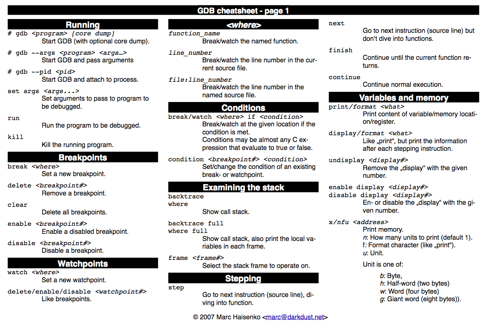
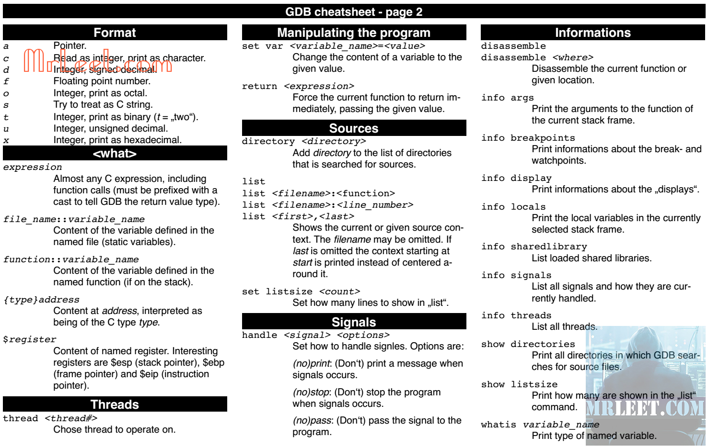

# Memory Types

### Memory Addresses and Hexadecimal Numbers

There are several reasons why it is preferable to use hex numbers instead of binary numbers (which computers store at the lowest level), three of which are given below:

1. **Readability**: It is significantly easier for a human to understand hex numbers as they resemble the decimal numbers we are used to. It is simply not intuitive to look at binary numbers and decide how big they are and how they relate to another binary number.
2. **Information density**: A hex number with two digits can express any number from 0 to 255 (because 16^2 is 256). To do the same in the binary system, we would require 8 digits. This difference is even more pronounced as numbers get larger and thus harder to deal with.
3. **Conversion into bytes**: Bytes are units of information consisting of 8 bits. Almost all computers are byte-addressed, meaning all memory is referenced by byte, instead of by bit. Therefore, using a counting system that can easily convert into bytes is an important requirement. We will shortly see why grouping bits into a byte plays a central role in understanding how computer memory works.


### Using the Debugger to Analyze Memory





**Example of running GDB debugger: **

```bash
gdb <script>
list # Output source code
break <N> # Break code at line N
run # Run the code
step # Run one more line of code
p <variable name> # Print variable content
p &<variable name> # Print address of the variable
x/<n><f><u> <variable address> # Print the variable memory
```


Computer memory represented as a sequence of data cells (e.g. 01010101) with their respective memory addresses shown on top.


**Types of Computer Memory**

- Registers
- RAM / ROM
- Cache (L1, L2)
- Virtual Memory
- Hard Disks, USB drives


Let us take a look at a typical computer usage scenario to see how the different types of memory are used:

1. After switching on the computer, it loads data from its read-only memory (ROM) and performs a power-on self-test (POST) to ensure that all major components are working properly. Additionally, the computer memory controller checks all of the memory addresses with a simple read/write operation to ensure that memory is functioning correctly.
2. After performing the self-test, the computer loads the basic input/output system (BIOS) from ROM. The major task of the BIOS is to make the computer functional by providing basic information about such things as storage devices, boot sequence, security or auto device recognition capability.
3. The process of activating a more complex system on a simple system is called "bootstrapping": It is a solution for the chicken-egg-problem of starting a software-driven system by itself using software. During bootstrapping, the computer loads the operating system (OS) from the hard drive into random access memory (RAM). RAM is considered "random access" because any memory cell can be accessed directly by intersecting the respective row and column in the matrix-like memory layout. For performance reasons, many parts of the OS are kept in RAM as long as the computer is powered on.
4. When an application is started, it is loaded into RAM. However, several application components are only loaded into RAM on demand to preserve memory. Files that are opened during runtime are also loaded into RAM. When a file is saved, it is written to the specified storage device. After closing the application, it is deleted from RAM.

The next hierarchical level above hard disks or other external storage devices is the RAM. We will not discuss in detail how it works but only take a look at some key performance metrics of the CPU at this point, which place certain performance expectations on the RAM and its designers:

1. The **bit size** of the CPU decides how many bytes of data it can access in RAM memory at the same time. A 16-bit CPU can access 2 bytes (with each byte consisting of 8 bit) while a 64-bit CPU can access 8 bytes at a time.
2. The **processing speed** of the CPU is measured in Gigahertz or Megahertz and denotes the number of operations it can perform in one second.


### Cache Levels

Cache memory is much faster but also significantly smaller than standard RAM. It holds the data that will (or might) be used by the CPU more often. In the memory hierarchy we have seen in the last section, the cache plays an intermediary role between fast CPU and slow RAM and hard disk. The figure below gives a rough overview of a typical system architecture:


1. **Level 1 cache** is the fastest and smallest memory type in the cache hierarchy. In most systems, the L1 cache is not very large. Mostly it is in the range of 16 to 64 kBytes, where the memory areas for instructions and data are separated from each other (L1i and L1d, where "i" stands for "instruction" and "d" stands for "data". Also see "[Harvard architecture](https://en.wikipedia.org/wiki/Harvard_architecture)" for further reference). The importance of the L1 cache grows with increasing speed of the CPU. In the L1 cache, the most frequently required instructions and data are buffered so that as few accesses as possible to the slow main memory are required. This cache avoids delays in data transmission and helps to make optimum use of the CPU's capacity.
2. **Level 2 cache** is located close to the CPU and has a direct connection to it. The information exchange between L2 cache and CPU is managed by the L2 controller on the computer main board. The size of the L2 cache is usually at or below 2 megabytes. On modern multi-core processors, the L2 cache is often located within the CPU itself. The choice between a processor with more clock speed or a larger L2 cache can be answered as follows: With a higher clock speed, individual programs run faster, especially those with high computing requirements. As soon as several programs run simultaneously, a larger cache is advantageous. Usually normal desktop computers with a processor that has a large cache are better served than with a processor that has a high clock rate.
3. **Level 3 cache** is shared among all cores of a multicore processor. With the L3 cache, the [cache coherence](https://en.wikipedia.org/wiki/Cache_coherence) protocol of multicore processors can work much faster. This protocol compares the caches of all cores to maintain data consistency so that all processors have access to the same data at the same time. The L3 cache therefore has less the function of a cache, but is intended to simplify and accelerate the cache coherence protocol and the data exchange between the cores.


### Temporal and Spatial Locality

The following table presents a rough overview of the latency of various memory access operations. Even though these numbers will differ significantly between systems, the order of magnitude between the different memory types is noteworthy. While L1 access operations are close to the speed of a photon traveling at light speed for a distance of 1 foot, the latency of L2 access is roughly one order of magnitude slower already while access to main memory is two orders of magnitude slower.

In algorithm design, programmers can exploit two principles to increase runtime performance:

1. **Temporal locality** means that address ranges that are accessed are likely to be used again in the near future. In the course of time, the same memory address is accessed relatively frequently (e.g. in a loop). This property can be used at all levels of the memory hierarchy to keep memory areas accessible as quickly as possible.
2. **Spatial locality** means that after an access to an address range, the next access to an address in the immediate vicinity is highly probable (e.g. in arrays). In the course of time, memory addresses that are very close to each other are accessed again multiple times. This can be exploited by moving the adjacent address areas upwards into the next hierarchy level during a memory access.

### Problems with physical memory

Virtual memory is a very useful concept in computer architecture because it helps with making your software work well given the configuration of the respective hardware on the computer it is running on.


There are several other memory-related problems, that programmers need to know about:

1. **Holes in address space** : If several programs are started one after the other and then shortly afterwards some of these are terminated again, it must be ensured that the freed-up space in between the remaining programs does not remain unused. If memory becomes too fragmented, it might not be possible to allocate a large block of memory due to a large-enough free contiguous block not being available any more.
2. **Programs writing over each other** : If several programs are allowed to access the same memory address, they will overwrite each others' data at this location. In some cases, this might even lead to one program reading sensitive information (e.g. bank account info) that was written by another program. This problem is of particular concern when writing concurrent programs which run several threads at the same time.

The basic idea of virtual memory is to separate the addresses a program may use from the addresses in physical computer memory. By using a mapping function, an access to (virtual) program memory can be redirected to a real address which is guaranteed to be protected from other programs.


### Virtual space


With virtual memory however, a mapping is performed between the virtual address space a program sees and the physical addresses of various storage devices such as the RAM but also the hard disk. Mapping makes it possible for the operating system to use physical memory for the parts of a process that are currently being used and back up the rest of the virtual memory to a secondary storage location such as the hard disk. With virtual memory, the size of RAM is not the limit anymore as the system hard disk can be used to store information as well.

With virtual memory, the RAM acts as a cache for the virtual memory space which resides on secondary storage devices. On Windows systems, the file `pagefile.sys` is such a virtual memory container of varying size. To speed up your system, it makes sense to adjust the system settings in a way that this file is stored on an SSD instead of a slow magnetic hard drive, thus reducing the latency. On a Mac, swap files are stored in`/private/var/vm/`.

In a nutshell, virtual memory guarantees us a fixed-size address space which is largely independent of the system configuration. Also, the OS guarantees that the virtual address spaces of different programs do not interfere with each other.

**Two important terms which are often used in the context of caches and virtual memory:**

- A **memory page** is a number of directly successive memory locations in virtual memory defined by the computer architecture and by the operating system. The computer memory is divided into memory pages of equal size. The use of memory pages enables the operating system to perform virtual memory management. The entire working memory is divided into tiles and each address in this computer architecture is interpreted by the Memory Management Unit (MMU) as a logical address and converted into a physical address.
- A **memory frame** is mostly identical to the concept of a memory page with the key difference being its location in the physical main memory instead of the virtual memory.


In summary, virtual memory management is performed by the operating system and programmers do usually not interfere with this process. The major benefit is a unique perspective on a chunk of memory for each program that is only limited in its size by the architecture of the system (32 bit, 64 bit) and by the available physical memory, including the hard disk.


