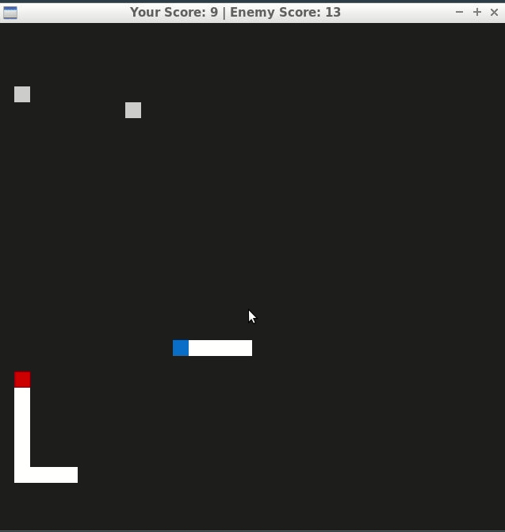

# CPPND: Capstone Snake Game Example

This is my Capstone project of [Udacity C++ Nanodegree Program](https://www.udacity.com/course/c-plus-plus-nanodegree--nd213). Project Option 2 is chosen. The starter repo is the source code for a super simple classic snake game. In this project, I have added a few exciting features as follow. 

- Compete with our AI snake called "Greedy" !
- Multiple food is spawned with different colors. 

| Food Type             | Color  | Functions        | Score | Duration  |
| --------------------- | ------ | ---------------- | ----- | --------- |
| Normal Food (kNormal) | Gray   | Grow body by 1   | 1     | 5 seconds |
| Booster (kBoost)      | Green  | Speed up by 0.05 | 3     | 5 seconds |
| Slim Pill (kCut)      | Yellow | Cut body by 3    | 3     | 5 seconds |

To be able to achieve the new features, I have made some major code modification:

- Create food class to handle multiple food lifecycle and functionality easily.
- Implement multi-threading for SDL rendering at background.
- Use references and shared_ptr throughout the project.

## **Gameplay**

## Dependencies for Running Locally
* cmake >= 3.7
  * All OSes: [click here for installation instructions](https://cmake.org/install/)
* make >= 4.1 (Linux, Mac), 3.81 (Windows)
  * Linux: make is installed by default on most Linux distros
  * Mac: [install Xcode command line tools to get make](https://developer.apple.com/xcode/features/)
  * Windows: [Click here for installation instructions](http://gnuwin32.sourceforge.net/packages/make.htm)
* SDL2 >= 2.0
  * All installation instructions can be found [here](https://wiki.libsdl.org/Installation)
  * Note that for Linux, an `apt` or `apt-get` installation is preferred to building from source.
* gcc/g++ >= 5.4
  * Linux: gcc / g++ is installed by default on most Linux distros
  * Mac: same deal as make - [install Xcode command line tools](https://developer.apple.com/xcode/features/)
  * Windows: recommend using [MinGW](http://www.mingw.org/)

## Basic Build Instructions

1. Clone this repo.
2. Make a build directory in the top level directory: `mkdir build && cd build`
3. Compile: `cmake .. && make`
4. Run it: `./SnakeGame`.

## Code Structure

The main classes of the program are `Game`, `Snake`, `Food`, `FoodManager`, `Controller` and `Renderer`.

**Game** is composed of objects of `Snake`, `Food`, `FoodManager`, `Controller` and `Renderer`. This class run the main Game Loop where all the action takes palce.

**Snake** class describes the user snake and enemy snack. It contains information and beavior of the snake.

**Food** class describes food type and position. 

**FoodManager** controls multiple foods lifecycle and ownership.

**Controller** handles the input and makes the snake move.

**Renderer** renders the game by creating SDL window, loading assets and drawing all the UI elements.

## Rubric Points Addressed

### README (All Rubric Points REQUIRED)

| CRITERIA                                                     | MEETS SPECIFICATIONS |
| ------------------------------------------------------------ | -------------------- |
| A README with instructions is included with the project      | This file            |
| The README indicates which project is chosen.                | Project Description  |
| The README includes information about each rubric point addressed. | This section         |

### Compiling and Testing (All Rubric Points REQUIRED)

| CRITERIA                             | MEETS SPECIFICATIONS                                         |
| :----------------------------------- | :----------------------------------------------------------- |
| The submission must compile and run. | The project can be compiled and run by following the instruction included in section above. |

### Loops, Functions, I/O

| CRITERIA                                                     | MEETS SPECIFICATIONS                                         |
| :----------------------------------------------------------- | :----------------------------------------------------------- |
| The project demonstrates an understanding of C++ functions and control structures. | Can be seen in all src files.                                |
| The project accepts user input and processes the input.      | Controller accepts input from user to control snake movement, can be found in [controller.cpp](src/controller.cpp). |

### Object Oriented Programming

| CRITERIA                                                     | MEETS SPECIFICATIONS                                         |
| :----------------------------------------------------------- | :----------------------------------------------------------- |
| The project uses Object Oriented Programming techniques.     | Can be seen in all objects files, the structure is explain in above section too. |
| Classes use appropriate access specifiers for class members. | Can be seen in all header files.                             |
| Class constructors utilize member initialization lists.      | Can be seen in all cpp files, e.g. [renderer.cpp](src/renderer.cpp). |
| Classes encapsulate behavior.                                | Can be seen in all files, e.g. [food.h](src/food.h).         |

### Memory Management

| CRITERIA                                                     | MEETS SPECIFICATIONS                                         |
| :----------------------------------------------------------- | :----------------------------------------------------------- |
| The project makes use of references in function declarations. | Pass-by-reference is throughout the project code, e.g. [food.h](src/food.h). |
| The project uses destructors appropriately.                  | Destructor is used to destroy thread, can be found in [game.cpp](src/game.cpp). |
| The project uses smart pointers instead of raw pointers.     | Store scores in `std::vector<std::shared_ptr>`, can be found in [game.h](src/game.h). |

### Concurrency

| CRITERIA                                | MEETS SPECIFICATIONS                                         |
| :-------------------------------------- | :----------------------------------------------------------- |
| The project uses multithreading.        | The project uses a new thread to process SDL rendering.      |
| A mutex or lock is used in the project. | `mutex` and `lock_guard` are used to protect data that is shared across multiple threads, e.g. [game.cpp](src/game.cpp). |